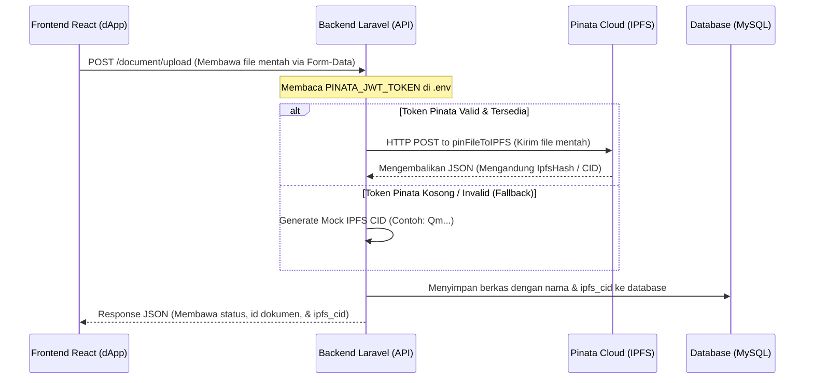

# Dokumentasi Alur Kerja Integrasi Pinata IPFS

Dokumen ini menjelaskan alur kerja (*workflow*) pengunggahan berkas, gambar program (kampanye), dan dokumen persyaratan penerima bantuan ke IPFS melalui layanan **Pinata Cloud** dalam dApp Philanthropy Chain.

---

## 1. Arsitektur Unggah Berkas & Gambar ke IPFS

Seluruh berkas yang diunggah oleh pengguna (baik berkas identitas KTP/SKTM penerima bantuan maupun gambar sampul program yayasan) diproses melalui server backend Laravel sebagai jembatan (*gateway*) menuju Pinata IPFS untuk menjaga keamanan token JWT API Pinata.



---

## 2. Alur Pengunggahan Khusus

### A. Pengunggahan Berkas Persyaratan Penerima Bantuan (KTP, SKTM, dll.)
1. Penerima mengisi form pengajuan bantuan dan melampirkan berkas fisik melalui form modal di tab **Status Bantuan**.
2. Frontend memanggil `ajukanBantuan(formData, fileMap)` di [PhilanthropyContext.jsx](file:///c:/Users/Acer/OneDrive/Dokumen/philantrophy-project/frontend/src/context/PhilanthropyContext.jsx).
3. Berkas dikirim ke endpoint `/api/v1/document/upload` menggunakan format `multipart/form-data`.
4. Backend menyimpan data fisik berkas di penyimpanan lokal `/storage/documents` dan mendaftarkan sidik jari berkas ke IPFS Pinata untuk mendapatkan **IPFS CID**.
5. Nilai `ipfs_cid` disimpan dalam tabel `documents`.

### B. Pengunggahan Gambar Program Baru oleh Yayasan
1. Yayasan membuat program baru melalui form **Buat Program Baru** di dashboard Yayasan dengan mengunggah gambar sampul.
2. Ketika form disubmit, fungsi `handleCreateCampaign` di [yayasan.jsx](file:///c:/Users/Acer/OneDrive/Dokumen/philantrophy-project/frontend/src/pages/yayasan.jsx) menangkap objek berkas mentah (`File`) di bawah properti `imageFile` dan memanggil `context.tambahProgram(nc)`.
3. Fungsi `tambahProgram` di [PhilanthropyContext.jsx](file:///c:/Users/Acer/OneDrive/Dokumen/philantrophy-project/frontend/src/context/PhilanthropyContext.jsx) mendeteksi keberadaan objek file:
   * Jika ada file gambar, frontend memanggil endpoint `/api/v1/document/upload` terlebih dahulu untuk memproses gambar tersebut ke Pinata IPFS.
   * Setelah mendapatkan respon berupa `ipfs_cid`, URL gambar diubah menjadi tautan gerbang IPFS publik: `https://gateway.pinata.cloud/ipfs/{cid}`.
4. Program baru disimpan ke tabel `campaigns` dengan kolom `image_url` yang mengarah ke link IPFS tersebut.

---

## 3. Penanganan Fallback (Mock CID) jika Token Pinata Kosong

Untuk memudahkan pengujian lokal tanpa koneksi internet atau jika token `PINATA_JWT_TOKEN` belum dimasukkan pada file `.env` di backend, sistem secara otomatis akan menggunakan metode **Fallback**:

1. **Backend Generator:** Backend Laravel akan membuat hash SHA-1 unik dari nama berkas dan waktu unggah, kemudian menambahkan prefiks `Qm` sehingga menghasilkan string sepanjang 46 karakter yang menyerupai hash IPFS asli.
2. **Database Fallback:** Jika di database ditemukan data dokumen lama yang kolom `ipfs_cid`-nya bernilai `null`, `DocumentController` secara otomatis memproduksi mock hash on-the-fly agar data tidak pernah menampilkan `"N/A"` di dApp.

---

## 4. Konfigurasi Kunci API Pinata

Untuk menghubungkan ke akun Pinata Anda yang asli:
1. Buka akun [Pinata Cloud](https://app.pinata.cloud/) Anda.
2. Di menu samping kiri, klik **API Keys** -> buat token akses baru dengan opsi admin (atau izin pin file).
3. Salin **JWT Token** panjang yang dihasilkan.
4. Buka berkas `.env` di direktori backend dApp Anda, lalu tambahkan baris berikut:
   ```env
   PINATA_JWT_TOKEN=isi_dengan_jwt_token_pinata_anda_yang_sangat_panjang
   ```
5. Restart server Laravel Anda (`php artisan serve`).

Setelah konfigurasi tersebut terpasang, setiap gambar program baru atau berkas persyaratan yang Anda unggah otomatis akan terdaftar dan masuk langsung ke menu **Files** di dashboard Pinata Anda secara riil!
