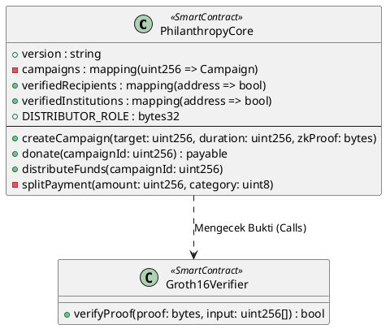
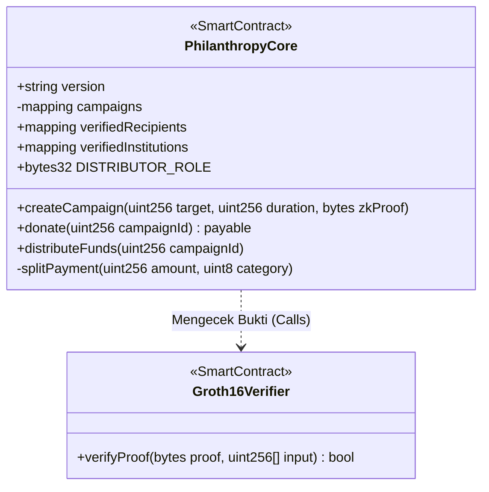
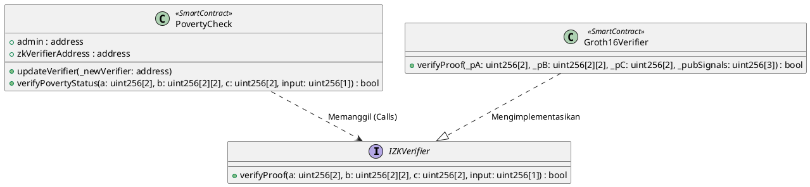
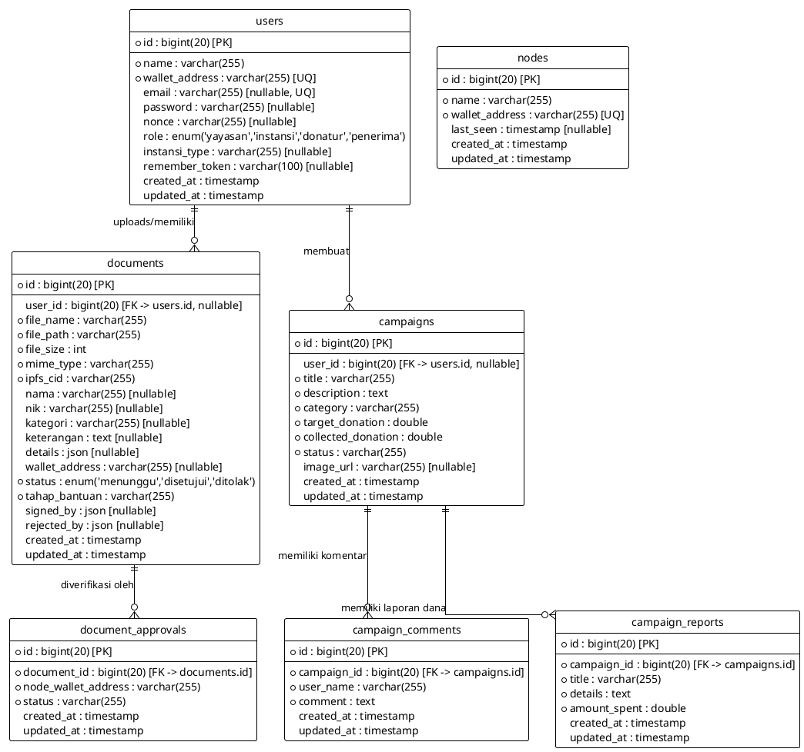
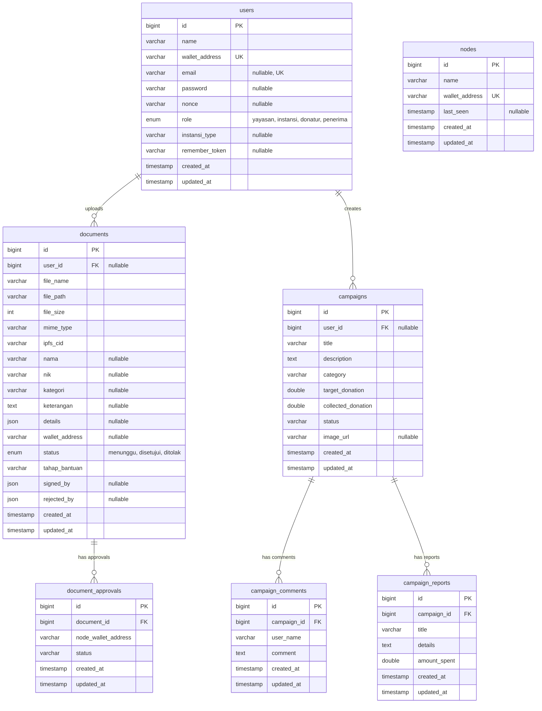

# 📊 Kode Diagram UML & ERD (PlantUML & Mermaid)
**PhilanthropyChain dApp**

Dokumen ini berisi kode teks diagram UML Class Diagram (untuk Smart Contracts) dan Database ERD (Entity Relationship Diagram) yang disesuaikan dengan struktur proyek Anda. 

Anda dapat langsung menyalin (copy-paste) kode di bawah ini untuk dimasukkan ke **draw.io** (fitur **Arrange > Insert > Advanced > PlantUML** atau **Mermaid**).

---

## 1. Smart Contract UML Class Diagram (Sesuai Foto Slide)
Gunakan kode ini untuk mereplikasi Class Diagram kontrak pintar yang ada pada foto presentasi Anda.

### A. Kode PlantUML (Disarankan untuk draw.io)

### B. Kode Mermaid

---

## 2. Smart Contract UML Class Diagram (Sesuai Kode Aktual/Asli Project)
Jika Anda membutuhkan UML yang menggambarkan struktur kontrak pintar yang **saat ini ada di project Anda** (`PovertyCheck.sol` dan `verifier.sol`).

### A. Kode PlantUML (Disarankan untuk draw.io)

---

## 3. Database Entity Relationship Diagram (ERD)
Gunakan diagram ini untuk menggambarkan struktur tabel basis data Laravel (MySQL/PostgreSQL) beserta relasi antar-tabelnya (User, Document, Campaign, Comments, Reports, dll.).

### A. Kode PlantUML (Disarankan untuk draw.io)

### B. Kode Mermaid ERD

---

## 💡 Cara Import ke Draw.io
1. Buka [draw.io](https://app.diagrams.net/).
2. Pada menu bar, pilih **Arrange** > **Insert** > **Advanced** > **PlantUML...** (atau **Mermaid...** jika menggunakan kode Mermaid).
3. Salin kode blok di atas, lalu tempel (paste) ke dalam kolom input yang tersedia.
4. Klik **Insert**. Diagram akan otomatis dibuat dan siap Anda rapikan/desain ulang di canvas draw.io!
