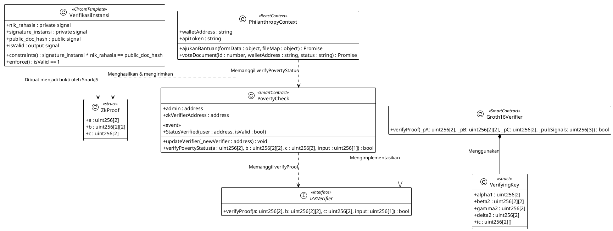
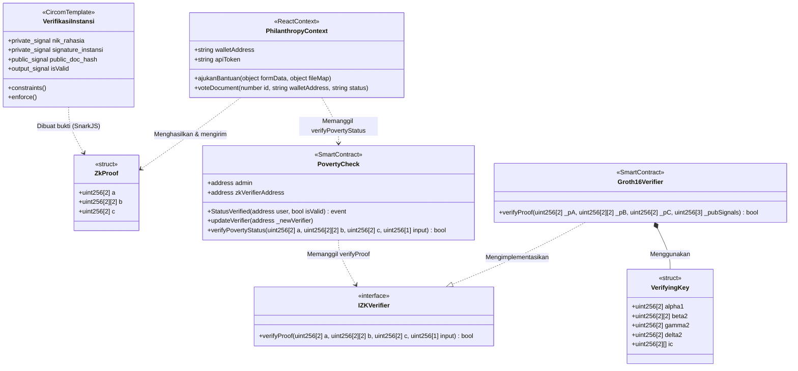

# 🛡️ UML Class Diagram - Smart Contract & ZK-SNARK Components
**PhilanthropyChain dApp**

Dokumen ini berisi rancangan **UML Class Diagram** murni yang merepresentasikan relasi kelas, interface, *struct*, *event*, atribut, dan metode dari seluruh komponen Smart Contract (`PovertyCheck` & `verifier.sol`), sirkuit Circom (`verifikasi_bantuan.circom`), serta React Context (`PhilanthropyContext.jsx`).

Anda dapat langsung menyalin kode teks di bawah ini ke **draw.io** via menu **Arrange > Insert > Advanced > PlantUML** (atau **Mermaid**).

---

## 1. Kode PlantUML (Disarankan untuk draw.io)
Salin kode berikut ke draw.io melalui **Arrange > Insert > Advanced > PlantUML...**

---

## 2. Kode Mermaid Class Diagram
Salin kode berikut ke draw.io melalui **Arrange > Insert > Advanced > Mermaid...**

---

## 🔍 Penjelasan Relasi:
*   **`VerifikasiInstansi` ke `ZkProof` (Dependency)**: Sirkuit Circom menetapkan kendala yang digunakan SnarkJS untuk menghasilkan `ZkProof`.
*   **`PhilanthropyContext` ke `ZkProof` (Dependency)**: Frontend menghitung bukti dan mengirimkan struktur data bukti ini ke smart contract.
*   **`PhilanthropyContext` ke `PovertyCheck` (Dependency)**: Frontend memanggil fungsi `verifyPovertyStatus` dengan parameter bukti ZKP.
*   **`PovertyCheck` ke `IZKVerifier` (Dependency)**: Kontrak utama memanggil fungsi interface `verifyProof` untuk melakukan pencocokan bukti ZKP.
*   **`Groth16Verifier` ke `IZKVerifier` (Realization)**: Kontrak verifikator yang dihasilkan SnarkJS mengimplementasikan interface verifikasi ZKP.
*   **`Groth16Verifier` ke `VerifyingKey` (Association/Composition)**: Verifikator menggunakan data kunci verifikasi yang berisi titik-titik kurva eliptik Alpha, Beta, Gamma, dan Delta.
