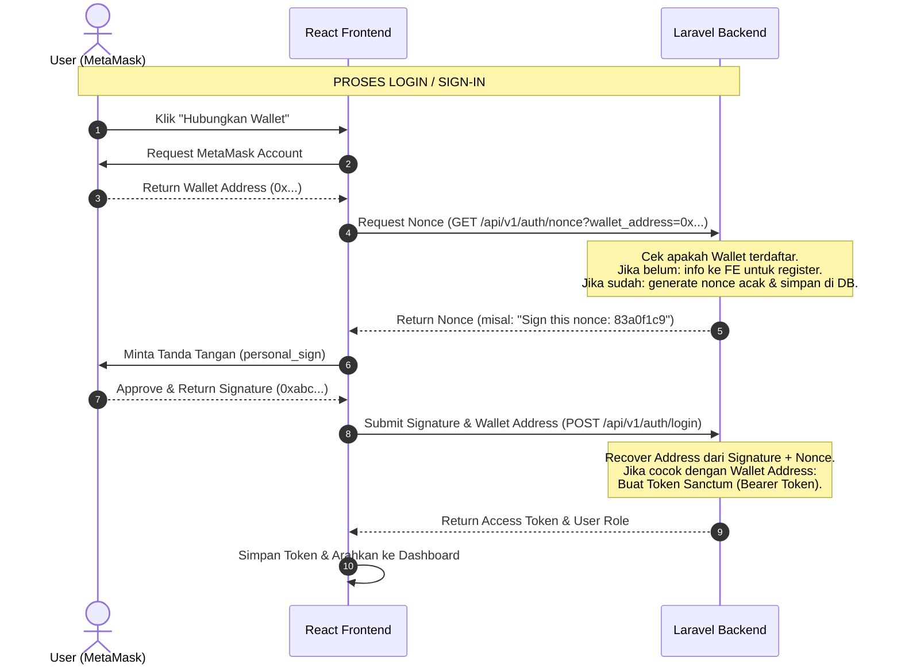

# 🔐 Web3 Authentication Flow (Tanpa Email & Password)
**PhilanthropyChain dApp**

Dokumen ini menjelaskan rancangan sistem autentikasi (Registrasi & Login) berbasis **Web3 (Crypto Wallet / MetaMask)** secara penuh. Pada arsitektur ini, kita **menghapus pengisian username, email, dan password tradisional**, dan menggantinya dengan tanda tangan kriptografi (cryptographic signature) menggunakan private key dompet MetaMask milik user.

---

## 💡 Konsep Dasar: Web2 vs Web3 Auth

| Fitur | Autentikasi Tradisional (Web2) | Autentikasi Web3 (MetaMask) |
| :--- | :--- | :--- |
| **Identitas Pengguna** | Username / Email | Wallet Address (Alamat Ethereum / MetaMask) |
| **Bukti Kepemilikan** | Password (Disimpan dalam bentuk hash di DB) | Tanda Tangan Kriptografi (Digital Signature) |
| **Validasi Backend** | Mencocokkan input password dengan hash DB | Memulihkan (recover) alamat dari signature & mencocokkannya |
| **Kunci Keamanan** | Password yang dibuat pengguna | Private Key yang aman di dalam MetaMask |

---

## 🛠️ Perubahan Struktur Data (Database Migration)

Untuk menyesuaikan dengan login tanpa email dan password, kita harus mengubah migrasi tabel `users`.
Pada file `backend/database/migrations/0001_01_01_000000_create_users_table.php`, kita melakukan perubahan berikut:

1. **`wallet_address`**: Menjadi kolom utama, wajib diisi (`nullable` dihapus), dan harus unik (`unique()`).
2. **`email`**: Diubah menjadi `nullable()` agar opsional.
3. **`password`**: Diubah menjadi `nullable()` karena tidak digunakan untuk login.
4. **`nonce`**: Ditambahkan sebagai kolom baru untuk menyimpan string acak sementara guna mencegah serangan Replay Attack.

### 📝 Contoh Kode Migrasi Baru:
```php
Schema::create('users', function (Blueprint $table) {
    $table->id();
    $table->string('name'); // Nama pengguna tetap diperlukan
    $table->string('wallet_address')->unique(); // ID Utama di Web3
    $table->string('email')->nullable()->unique(); // Opsional (bisa diisi nanti)
    $table->string('password')->nullable(); // Tidak wajib, karena login pakai wallet
    $table->string('nonce')->nullable(); // String acak untuk verifikasi signature
    $table->enum('role', ['yayasan', 'instansi', 'donatur', 'penerima'])->default('donatur');
    $table->string('instansi_type')->nullable(); // dinsos | diknas | bpbd | dinkes
    $table->rememberToken();
    $table->timestamps();
});
```

---

## 🔄 Alur Kerja Sistem (Workflow)



---

## 📋 Struktur Input Form (Frontend)

Dengan dihapusnya Username, Email, dan Password, form pendaftaran dan login menjadi jauh lebih ringkas:

### 1. Form Login
Tidak ada form pengisian teks! Hanya ada satu tombol:
*   **Tombol `[ HUBUNGKAN WALLET & MASUK ]`**
    *   *Cara kerja:* Mengambil alamat wallet dari MetaMask, meminta backend mengirimkan nonce, meminta tanda tangan MetaMask, dan mengirimkannya kembali ke backend untuk login.

### 2. Form Registrasi (Pendaftaran)
Hanya mengisi data profil dan peran (role) yang dipilih:
*   **Alamat Wallet (Otomatis)**: Terisi otomatis dari MetaMask (Read-Only).
*   **Nama Lengkap (Teks)**: Nama Yayasan / Instansi / Donatur / Penerima.
*   **Peran / Role (Pilihan/Dropdown)**:
    *   `donatur` (Donatur Umum)
    *   `penerima` (Penerima Manfaat / Korban Bencana)
    *   `yayasan` (Yayasan Penyalur)
    *   `instansi` (Dinas/Lembaga Negara)
*   **Tipe Instansi (Pilihan/Dropdown - Muncul hanya jika Role = `instansi`)**:
    *   `dinsos` (Dinas Sosial)
    *   `diknas` (Dinas Pendidikan)
    *   `bpbd` (Badan Penanggulangan Bencana Daerah)
    *   `dinkes` (Dinas Kesehatan)

*Tidak ada field Email, Password, maupun Konfirmasi Password!*

---

## 💻 Implementasi Backend (Laravel 13)

### 1. Endpoint Baru untuk Nonce
Backend memerlukan endpoint untuk menghasilkan string acak acak (nonce) yang unik setiap kali user ingin login/register.
*   `GET /api/v1/auth/nonce?wallet_address=0x...`

### 2. Verifikasi Kriptografi di Laravel
Untuk memverifikasi tanda tangan dari MetaMask di backend PHP, kita dapat menggunakan library atau menulis fungsi ecRecover sederhana.
Verifikasi dilakukan dengan membandingkan alamat wallet yang mengirim request dengan alamat wallet hasil pemulihan (recovery) signature menggunakan pesan nonce asli.

Jika hasil verifikasi sukses:
1. Hapus nonce dari database (agar tidak bisa dipakai ulang).
2. Buat token Sanctum: `$user->createToken('auth_token')->plainTextToken`.
3. Kembalikan token ke frontend.

---

## 💻 Implementasi Frontend (React)

Pada file `landingpage.jsx`, fungsi `handleAuthSubmit` akan disesuaikan menjadi:

```javascript
const handleAuthSubmit = async (e) => {
  e.preventDefault();
  if (!window.ethereum) return setAlertMsg('MetaMask diperlukan!');

  setIsAuthLoading(true);
  try {
    // 1. Ambil wallet address dari MetaMask
    const accounts = await window.ethereum.request({ method: 'eth_requestAccounts' });
    const address = accounts[0].toLowerCase();

    if (authMode === 'register') {
      // --- PENDAFTARAN ---
      // Ambil nonce registrasi sementara dari backend
      const nonceRes = await fetch(`/api/v1/auth/nonce?wallet_address=${address}`);
      const { nonce } = await nonceRes.json();

      // Minta tanda tangan user
      const message = `Tanda tangani pesan ini untuk mendaftar ke PhilanthropyChain.\n\nNonce: ${nonce}`;
      const signature = await window.ethereum.request({
        method: 'personal_sign',
        params: [message, address],
      });

      // Kirim data registrasi ke backend
      const payload = {
        name: authForm.name,
        role: authForm.role,
        instansi_type: authForm.role === 'instansi' ? authForm.instansi_type : null,
        wallet_address: address,
        signature: signature,
        message: message
      };
      
      const response = await apiRegister(payload);
      // Simpan token & redirect...
    } else {
      // --- LOGIN ---
      // Ambil nonce login dari backend
      const nonceRes = await fetch(`/api/v1/auth/nonce?wallet_address=${address}`);
      const { nonce } = await nonceRes.json();

      // Minta tanda tangan user
      const message = `Tanda tangani pesan ini untuk masuk ke PhilanthropyChain.\n\nNonce: ${nonce}`;
      const signature = await window.ethereum.request({
        method: 'personal_sign',
        params: [message, address],
      });

      // Kirim signature ke backend untuk diverifikasi
      const payload = {
        wallet_address: address,
        signature: signature,
        message: message
      };

      const response = await apiLogin(payload);
      // Simpan token & redirect...
    }
  } catch (error) {
    setAuthError(error.message);
  } finally {
    setIsAuthLoading(false);
  }
};
```

---

## 📌 Kesimpulan Langkah Selanjutnya

Untuk merealisasikan autentikasi murni Web3 ini, kita perlu:
1.  **Update Database Migration**: Membuat `email` and `password` menjadi nullable, serta menambahkan `nonce` di tabel `users`.
2.  **Update AuthController di Laravel**:
    *   Membuat endpoint generator `nonce`.
    *   Menambahkan logic verifikasi signature (EC Recover) di dalam method `login` dan `register`.
3.  **Update Frontend (LandingPage.jsx)**:
    *   Menghapus input email, password, dan konfirmasi password dari UI modal login/registrasi.
    *   Menyesuaikan alur pengiriman payload agar menggunakan format signature + nonce.
