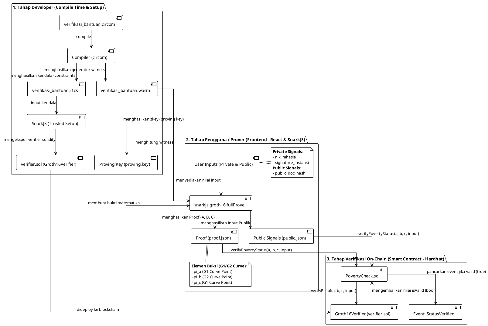

# 🔐 Arsitektur ZK-SNARK (Circom, SnarkJS, Hardhat & Groth16)
**PhilanthropyChain dApp**

Dokumen ini menjelaskan arsitektur dan alur kerja integrasi **Zero-Knowledge Proof (ZKP)** menggunakan **Circom**, **SnarkJS**, dan **Smart Contract (Hardhat Node)** untuk memverifikasi kelayakan penerima bantuan secara aman tanpa membocorkan data pribadi (NIK & tanda tangan digital).

---

## 📐 Komponen Utama ZK-SNARK

Diagram di bawah ini menggambarkan hubungan antar file/komponen dari tahap kompilasi sirkuit, pembuatan bukti di frontend, hingga verifikasi on-chain di smart contract.

### A. Kode PlantUML (Disarankan untuk draw.io)
Salin kode berikut dan masukkan ke draw.io melalui menu **Arrange > Insert > Advanced > PlantUML...**



### B. Kode Mermaid
Salin kode berikut untuk merender diagram menggunakan renderer Mermaid (bisa di draw.io via **Arrange > Insert > Advanced > Mermaid...**):

```mermaid
graph TD
    subgraph Dev["1. Tahap Developer (Compile Time & Setup)"]
        circom_code["verifikasi_bantuan.circom"] -->|compile| compiler["Compiler (circom)"]
        compiler -->|generates| wasm["verifikasi_bantuan.wasm"]
        compiler -->|generates| r1cs["verifikasi_bantuan.r1cs"]
        r1cs -->|input| snarkjs_setup["SnarkJS (Trusted Setup)"]
        snarkjs_setup -->|generates| zkey["Proving Key (proving.key)"]
        snarkjs_setup -->|exports| verifier_sol["verifier.sol (Groth16Verifier)"]
    end

    subgraph Client["2. Tahap Pengguna / Prover (Frontend - React & SnarkJS)"]
        inputs["Input Pengguna<br/>- Private: nik_rahasia, signature_instansi<br/>- Public: public_doc_hash"] -->|values| full_prove["snarkjs.groth16.fullProve"]
        wasm -->|calculate witness| full_prove
        zkey -->|prove statement| full_prove
        full_prove -->|generates| proof["Proof (proof.json)<br/>- pi_a (G1)<br/>- pi_b (G2)<br/>- pi_c (G1)"]
        full_prove -->|extracts| public_signals["Public Signals (public.json)"]
    end

    subgraph Blockchain["3. Tahap Verifikasi On-Chain (Hardhat Node)"]
        verifier_sol -->|deployed as| verifier_contract["Groth16Verifier (verifier.sol)"]
        poverty_check["PovertyCheck.sol"]
        
        proof -->|verifyPovertyStatus(a, b, c, input)| poverty_check
        public_signals -->|verifyPovertyStatus(a, b, c, input)| poverty_check
        poverty_check -->|verifyProof(a, b, c, input)| verifier_contract
        verifier_contract -->|returns boolean| poverty_check
        poverty_check -->|emits event| event["Event: StatusVerified"]
    end
```

---

## 🔄 Alur Kerja Data Kriptografi

1.  **Pembuatan Kendala (Constraints)**:
    Sirkuit `verifikasi_bantuan.circom` mendefinisikan aturan bahwa:
    $$\text{signature\_instansi} \times \text{nik\_rahasia} == \text{public\_doc\_hash}$$
    Jika persamaan ini benar, maka sirkuit menghasilkan sinyal `isValid = 1`.

2.  **Perhitungan Witness & Proof di Frontend**:
    *   Pengguna memasukkan NIK rahasia mereka dan tanda tangan instansi.
    *   SnarkJS menghitung witness menggunakan file WASM hasil kompilasi Circom.
    *   SnarkJS menggunakan file zkey (proving key) untuk membuat bukti matematika (Proof $A$, $B$, dan $C$) bahwa input tersebut valid sesuai kendala sirkuit, tanpa membeberkan nilai NIK maupun tanda tangan asli ke publik.

3.  **Verifikasi di Smart Contract**:
    *   Frontend mengirimkan bukti ($A, B, C$) dan input publik (`public_doc_hash`) ke fungsi `verifyPovertyStatus` pada kontrak `PovertyCheck.sol`.
    *   Kontrak `PovertyCheck` memanggil kontrak `Groth16Verifier` (`verifier.sol`) untuk mengevaluasi bilinear pairing kriptografis:
        $$e(A, B) == e(\alpha, \beta) \cdot e(x, \gamma) \cdot e(C, \delta)$$
    *   Jika evaluasi matematika tersebut benar (valid), verifikator mengembalikan `true`. Kontrak `PovertyCheck` akan memancarkan event `StatusVerified(msg.sender, true)` untuk mengesahkan kelayakan penerima bantuan di blockchain secara permanen.
